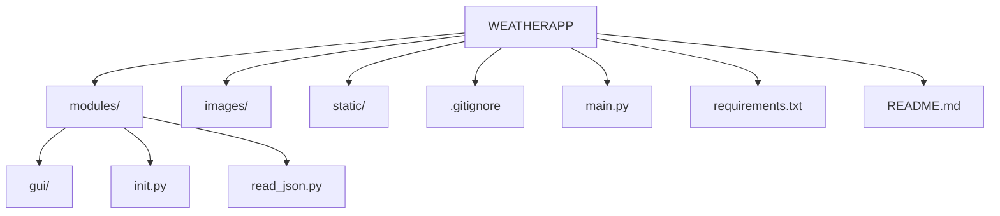

<h1>WEATHER APPLICATION</h1>

 
    Цей 
    проєкт розроблено з метою ознайомлення із роботою 
    <a href='https://developer.mozilla.org/en-US/docs/Glossary/API'>API</a>, 
    принципом отримання даних від віддаленого серверу, вмінням обробляти дані, структурувати та застосовувати у свому проєкті. А саме застосовувалось API такого веб-ресурсу як 
    <a href='https://openweathermap.org/'>OpenWeatherMap</a>.
    Проєкт допоможе розібратисяс у роботі файлів
    <a href='https://www.json.org/json-uk.html'>JSON</a>, 
    як правильно отримувати та зберігати дані у файлах з типом json. Та познайомить користувача з інтерфейсом застосунку розробленим за допомогою пакету 
    <a href='https://customtkinter.tomschimansky.com/'>Custotkinter</a>.

<h2 id= 'list'>Зміст:</h2>
<ol>
    <li>
        <a href='#all-modules'>Модулі проєкту</a>.
    </li>
    <li>
        <a href='#download-project'>Розгортання проєкту</a>.
    </li>
    <li>
        <a href='#create-venv'>Створення віртуального оточення</a>.
        <ul>
            <li>
                <a href='#windows'>Для Windows</a>.
            </li>
            <li>
                <a href='#mac-os'>Для Mac OS</a>.
            </li>
        </ul>
    </li>
    <li>
        <a href='#download-modules'>Завантаження модулей до віртуального проєкту</a>.
        <ul>
            <li>
                <a href='#requirements'>Завантаження requirements.txt</a>.
            </li>
            <li>
                <a href='#pip-install'>Завантаження окремих модулів</a>.
            </li>
        </ul>
    </li>
    <li>
        <a href='#start-project'>Старт проєкту</a>.
    </li>
    <li>
        <a href='#base-mechanics'>Основні механіки проєкту</a>.
    </li>
    <li>
        <a href='#result'>Висновок</a>.
    </li>
</ol>

<h3 id='all-modules'>Модулі проєкту</h3>
<h4>У цьому проєкті ми використовували такі модулі як:</h4>

1. os - Надає функції для взаємодії з операційною системою,наприклад,робота з файлами та каталогами,отримання інформації про систему

2. customtkinter - це бібліотека для Python,яка є надбудовою над стандартною бібліотекою Tkinter,призначеною для створення графічних інтерфейсів користувача(GUI)

3. json - використовується для роботи з форматом даних JSON (JavaScript Object Notation),який широко використовується для обміну даними між різними мовами програмування та системами

4. requests - в Python використовується для надсилання HTTP-запитів до веб-серверів

<h3 id='download-project'>Розгортання проєкту</h3>
<h4>Щоб завантажити(клонувати) проєкт та використовувати його в своїх цілях потрібно:</h4>

Github -> проєкт -> кнопка <>Code - силка -> клонування
1. Зайти в свій Github акаунт
2. Зайти на проєкт який ви хочете клонувати
3. Натиснути зелену кнопку <>Code
4. Скопіювати силку на проєкт (наприклад - https://github.com/Valentin5944/WeatherApp.git)
5. Відкрити Visual Studio code та клонувати проєкт за допомогою команди git clone. 
(приклад - git clone https://github.com/Valentin5944/WeatherApp.git)

<h3 id='create-venv'>Створення віртуального оточення</h3>
<h4 id='windows'>Для Windows</h4>

1. Для створення віртуального оточення у Python на Windows потрібно скористатися модулем venv.

2. Створення Віртуального Оточення: відрийте термінал та напишіть команду: python -m venv ім'я_оточення (приклад- python -m venv venv)

3. Активуйте віртуальне оточення: напишіть команду ім'я_оточення/Scripts/activate (приклад - venv/Scripts/activate)
<h4 id='mac-os'>Для Mac OS</h4>

1. Для створення віртуального оточення у Python на Windows потрібно скористатися модулем venv.

2. Створення Віртуального Оточення: відрийте термінал та напишіть команду: python3 -m venv ім'я_оточення (приклад- python3 -m venv venv)

3. Активуйте віртуальне оточення: напишіть команду ім'я_оточення/bin/activate (приклад - venv/bin/activate)

<h3 id='download-modules'>Завантаження модулей до віртуального проєкту</h3>

<h4 id='requirements'>Завантаження requirements.txt</h4>

<h5>Щоб створити requirements.txt треба:</h5>

* Використати команду pip freeze > requirements.txt у терміналі

<h4 id='pip-install'>Завантаження окремих модулів</h4>

1. os - Надає функції для взаємодії з операційною системою,наприклад,робота з файлами та каталогами,отримання інформації про систему,
щоб встановити треба використати команду import os

2. customtkinter - це бібліотека для Python,яка є надбудовою над стандартною бібліотекою Tkinter,призначеною для створення графічних інтерфейсів користувача(GUI),щоб встановити customtkinterтреба в терміналі використати команду pip install customtkinter

3. json - використовується для роботи з форматом даних JSON (JavaScript Object Notation),який широко використовується для обміну даними між різними мовами програмування та системами,щоб встановити цей модуль треба використати команду import json

4. requests - в Python використовується для надсилання HTTP-запитів до веб-серверів,щоб встановити цей модуль треба в терміналі використати команду pip install reguests

<h3 id='start-project'>Старт Проєкту</h3>

Main.py -> запуск

<h4>Щоб запустити проєкт потрібно:</h4>

1. Перейдіть в файл Main.py(або його називають Manage.py)
2. Треба написати код для запуску та натиснути кнопку ▷ (Start)

* if name == "main":
    modules.app.mainloop()

<h3 id='base-mechanics'>Основні механіки проєкту</h3>
<a href='#list'>
повернутись до змісту
     
</a>

<h4>1. Збір даних:</h4>

   * Дані прогнозу погоди надходять с сайту https://openweathermap.org/ та оброблюються, потім вони показуються на самому сайті WeatherApp

<h4>2. Обробка даних:</h4>

* Отримані дані з https://openweathermap.org/ обробляються на бекенді та надходять до сайту WeatherApp

<h4>3. Прогнозування</h4>

* На основі обробки даних через бекенд, прогноз та температуру буде показано на сайті WeatherApp

<h3 id='result'>Висновок</h3>

<h4>Отже, цей проєкт призначений для прогнозування та визначення погоди і температури та показу цього на сайті WeatherApp</h4>